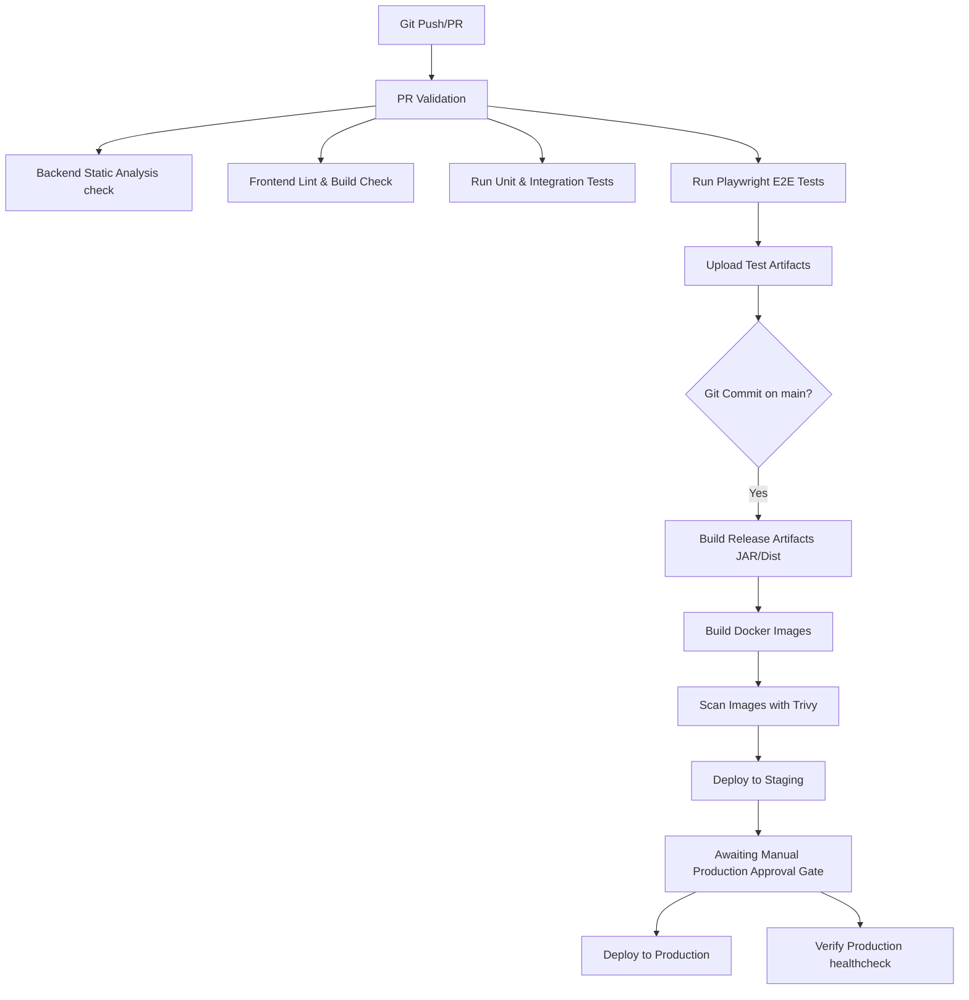

# RoomWallah – DevOps, CI/CD & Production Hardening Guide

This document defines the operations, deployment workflows, hardening features, and runbooks for the **RoomWallah** platform.

---

## 1. Local Development Quickstart

### Prerequisites
- **Java 21** (Eclipse Temurin recommendation)
- **Node.js 18+ & NPM**
- **Docker & Docker Compose**

### Running the Services Locally

#### 1. Configure the Environment
Copy the default environment template:
```bash
cp .env.example .env
```
Fill in the custom passwords and API secrets. Do **NOT** commit the `.env` file to source control.

#### 2. Start PostgreSQL & Redis
Boot the core dependency stores in the background:
```bash
docker-compose up -d db redis
```

#### 3. Run Backend Spring Boot App
Navigate to the backend directory and launch the application:
```bash
cd backend
./mvnw spring-boot:run
```
- API Documentation: [http://localhost:8080/swagger-ui/index.html](http://localhost:8080/swagger-ui/index.html)
- Actuator Health check: [http://localhost:8080/actuator/health](http://localhost:8080/actuator/health)

#### 4. Run Frontend React App
Navigate to the frontend directory, install dependencies, and launch Vite dev server:
```bash
cd frontend
npm install
npm run dev
```
- App Home: [http://localhost:5173](http://localhost:5173)

---

## 2. Code Quality & Static Analysis Checks

RoomWallah integrates strict code quality gates. Any violation of these gates will fail the CI/CD pipeline.

### Backend Static Analysis
Run Checkstyle, PMD, and SpotBugs validation checks locally:
```bash
cd backend
./mvnw clean compile checkstyle:check pmd:check spotbugs:check
```
- **Checkstyle Configuration**: [checkstyle.xml](file:///C:/Users/hp/.gemini/antigravity/scratch/roomwallah/backend/checkstyle.xml)
- **PMD Ruleset**: [pmd-ruleset.xml](file:///C:/Users/hp/.gemini/antigravity/scratch/roomwallah/backend/pmd-ruleset.xml)
- **SpotBugs Exclusions Filter**: [spotbugs-exclude.xml](file:///C:/Users/hp/.gemini/antigravity/scratch/roomwallah/backend/spotbugs-exclude.xml)

### Frontend Linting
Run ESLint check on React and TypeScript source files:
```bash
cd frontend
npm run lint
```
- **ESLint Configuration**: [.eslintrc.json](file:///C:/Users/hp/.gemini/antigravity/scratch/roomwallah/frontend/.eslintrc.json)

---

## 3. Containerization and Orchestration Hardening

### Docker Images (Production Ready)
Both frontend and backend Dockerfiles utilize **multi-stage builds** and run in a **non-root security context** to minimize security risks.

#### Backend Dockerfile Features:
- **Base JRE**: Alpine eclipse-temurin runtime (`eclipse-temurin:21-jre-alpine`).
- **Non-Root Execution**: Runs under system user/group `spring:spring`.
- **Actuator Healthcheck**: Checks `/actuator/health` via `wget -q --spider`.

#### Frontend Dockerfile Features:
- **WebServer**: Nginx Alpine (`nginx:alpine`).
- **Non-Root Execution**: Serves assets as the `nginx` system user.
- **Compression & Caching**: Gzip compression is enabled, caching headers are configured, and HSTS/CSP security policies are injected in [nginx.conf](file:///C:/Users/hp/.gemini/antigravity/scratch/roomwallah/frontend/nginx.conf).

### Docker Compose
Run the entire hardened production-oriented stacks locally:
```bash
docker-compose up -d --build
```
This allocates memory limits (limits: 1.5GB RAM for backend, 256MB for frontend) and enforces recovery restart policies (`restart: unless-stopped`).

---

## 4. Configuration Management & Environment Variables

The application relies on externalized environment parameters. Do not hardcode values in configurations.

| Variable Name | Description | Default Value | Production Guideline |
|---|---|---|---|
| `DB_HOST` | Database Hostname | `localhost` | `db` in Compose / Cloud Endpoint |
| `DB_PORT` | Database Port | `5432` | Standard PostgreSQL port |
| `DB_NAME` | Database schema name | `roomwallah` | Dedicated application schema |
| `DB_USER` | Database role username | `roomwallah_user` | Strict least-privilege role |
| `DB_PASSWORD` | Database connection password | `roomwallah_secure_pass` | High-entropy random secret |
| `REDIS_HOST` | Redis Server Host | `localhost` | `redis` in Compose / Managed Redis |
| `REDIS_PORT` | Redis Server Port | `6379` | Standard Redis port |
| `SERVER_PORT` | Backend Web Server Port | `8080` | Production proxy port |
| `JWT_SECRET` | Token signature HMAC-SHA256 key | *Scaffolded Default* | Must exceed 256 bits (32 bytes) |
| `VITE_API_URL` | Frontend API Target Prefix | `/api/v1` | Production gateway URL |

---

## 5. Automated CI/CD Pipeline

The GitHub Actions workflow [ci-cd.yml](file:///C:/Users/hp/.gemini/antigravity/scratch/roomwallah/.github/workflows/ci-cd.yml) automates build lifecycle:



---

## 6. Version Rollback Playbook

When a production deployment fails health checks or introduces critical faults, perform the following rollback sequence.

### Phase 1: Deploy Legacy Application version
1. Identify the last stable commit SHA or release tag (e.g. `v1.0.0-1234567`).
2. Update the target orchestrator tags to pull the stable release:
   ```bash
   docker-compose pull backend:v1.0.0-1234567
   docker-compose up -d backend
   ```

### Phase 2: Database Migration Check
- RoomWallah's Flyway migrations are strictly **additive and backward compatible**.
- Do **NOT** automatically run destructive table drops. If a migration needs revert, deploy a compensating rolling forward migration (e.g. `V23__revert_field_x.sql`) rather than using Flyway clean.

### Phase 3: Cache Invalidation
Whenever rolling back changes that modify cache schemas, flush active Redis cache values to prevent deserialization faults:
```bash
docker-compose exec redis redis-cli flushall
```

---

## 7. Troubleshooting & Operational Runbook

### Database Connection Limits Exhausted
- **Symptom**: `HikariPool-1 - Connection is not available, request timed out after 30000ms.`
- **Action**: Check active connections in Postgres:
  ```sql
  SELECT pid, age(clock_timestamp(), query_start), usename, query, state 
  FROM pg_stat_activity 
  WHERE state != 'idle' AND query NOT LIKE '%pg_stat_activity%';
  ```
  Ensure N+1 query loops are optimized and Hikari `max-lifetime` is configured lower than PostgreSQL's `idle_in_transaction_session_timeout`.

### Flyway Out-of-Order Migration Errors
- **Symptom**: `FlywayException: Validate failed: Migration checksum mismatch` or `Out of order migration detected`.
- **Action**: Check state in `flyway_schema_history`. If a migration was modified after execution, fix the checksum by running:
  ```bash
  ./mvnw flyway:repair
  ```
  *Note: Only do this if you are absolutely sure the local schema matches production.*

### Redis Memory Limits Exceeded
- **Symptom**: `OOM command not allowed when used memory > 'maxmemory'` in logs.
- **Action**: Check active Redis memory usage:
  ```bash
  docker-compose exec redis redis-cli info memory
  ```
  Ensure `maxmemory-policy` is set to `allkeys-lru` or `volatile-lru` in Redis config to allow eviction of expired caches.
