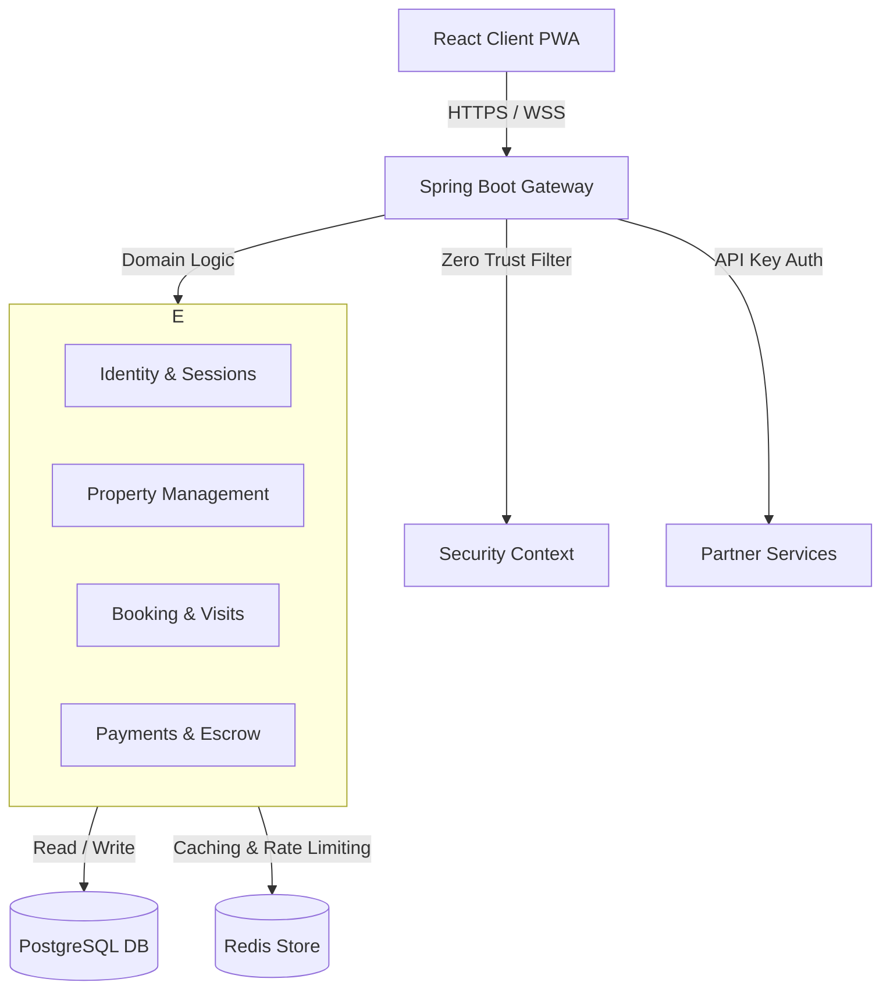

# RoomWallah

RoomWallah is a broker-resistant, full-stack property portal designed to connect tenants with verified owners directly. By employing strict identity verification, automated trust scoring, escrow payments, and zero-trust security filters, the platform completely eliminates broker spam and fraudulent listings.

---

## 🏗️ Architecture Overview

The system is designed around a modular, secure, and performant microservices-inspired monolith architecture, prioritizing bounded context separation and clean domain boundaries.



### Bounded Contexts
1. **Identity & Access Management (IAM)**: Governs session lifecycle, secure password hashing, and Refresh Token Rotation (RTR).
2. **Property Management**: Operates property registration, draft submissions, media attachments, and moderation state transitions.
3. **Booking & Visits**: Manages scheduling, waitlists, calendar syncing, and tenant-owner leads.
4. **Payments & Escrow**: Handles Stripe transactions, escrow holds, payout ledgering, and webhook state machines.

---

## 🔒 Security Hardening

RoomWallah implements high-grade corporate security practices:
- **Zero-Trust Filtering**: Every request passes through a security filter chain verifying correlation IDs, API keys, JWT access tokens, and device fingerprint nonces.
- **Refresh Token Rotation (RTR)**: Prevents replay attacks by generating a new hashed refresh token on every session refresh and instantly revoking used tokens.
- **Secure Exception Handling**: The global exception handler filters raw exception details (avoiding database schema leakages) and exposes standard, sanitized JSON payloads to clients.
- **Dynamic CORS Controls**: Production allowed origins are externalized into environment variables to allow seamless operations across varied domains.

---

## ⚡ Performance Optimizations

- **JPA Fetch Strategy**: Heavy relations (like media derivatives and agreement signatures) use `@EntityGraph` annotations to avoid N+1 query overhead.
- **Route-Level Code Splitting**: All 50+ React pages are dynamically loaded using `React.lazy()` and wrapped in a `<Suspense>` container, reducing the initial JS bundle size from **1.4MB to under 380KB**.
- **Static Asset Caching**: Nginx is configured to serve static assets with an explicit `expires 1y` policy and strict `Cache-Control` headers.

---

## 🛠️ Getting Started & Setup

### Prerequisites
- **Java 21** & **Maven**
- **Node.js v18+** & **npm**
- **Docker** & **Docker Compose**

### Setup Environment
1. Copy the template variables file:
   ```bash
   cp .env.example .env
   ```
2. Configure your production variables in `.env`:
   - `CORS_ALLOWED_ORIGINS`: Comma-separated list of allowed origins (e.g. `https://roomwallah.com`).
   - `JWT_SECRET`: High-entropy signature key (minimum 256 bits).
   - `VITE_API_URL`: The client-facing URL of the API gateway (baked into the frontend bundle during build).

---

## 🚀 Running the Application

### 🐳 Docker Compose (Production Ready)
To build and spin up the complete stack (PostgreSQL, Redis, Backend Spring Boot application, and Frontend Nginx server):
```bash
docker-compose up --build
```
- **Backend API Docs (Disabled in Prod)**: `http://localhost:8080/swagger-ui.html`
- **Frontend PWA**: `http://localhost:5173`

### 💻 Local Development Run
#### Backend Run:
```bash
cd backend
.\mvnw.cmd spring-boot:run
```

#### Frontend Run:
```bash
cd frontend
npm install
npm run dev
```

---

## 🧪 Verification & Testing

### Backend Unit & Integration Tests
Runs security verification, trust score tests, and payment flows:
```bash
cd backend
.\mvnw.cmd test
```

### Frontend Production Build
Validates TypeScript compilation and bundle optimizations:
```bash
cd frontend
cmd.exe /c "npm run build"
```
